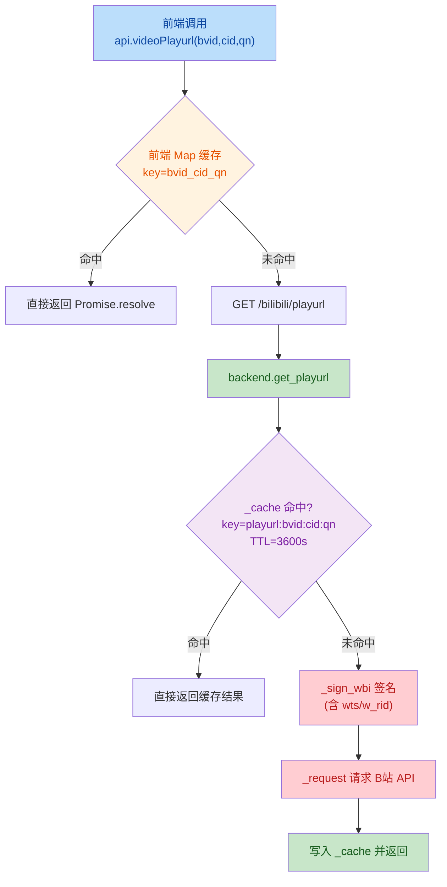
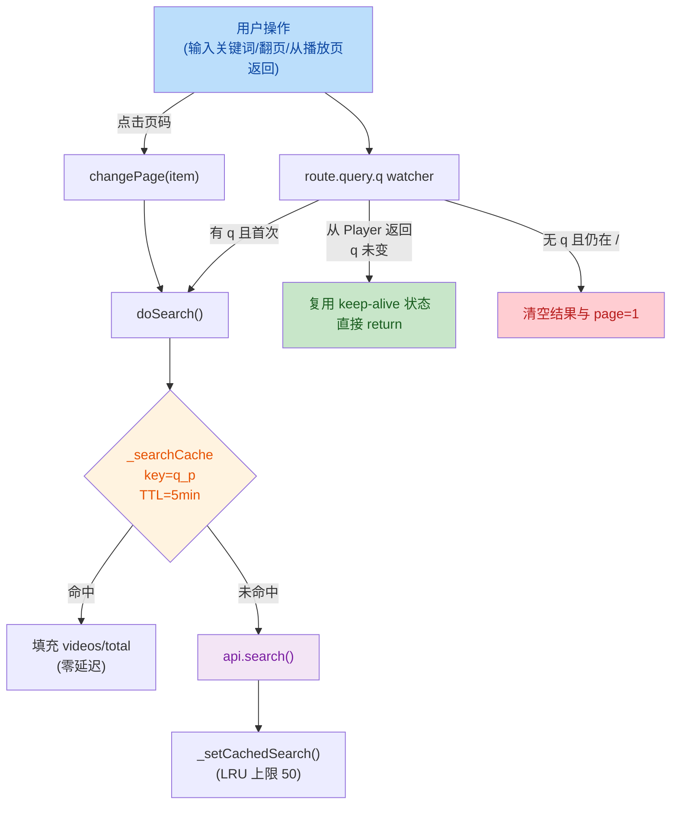
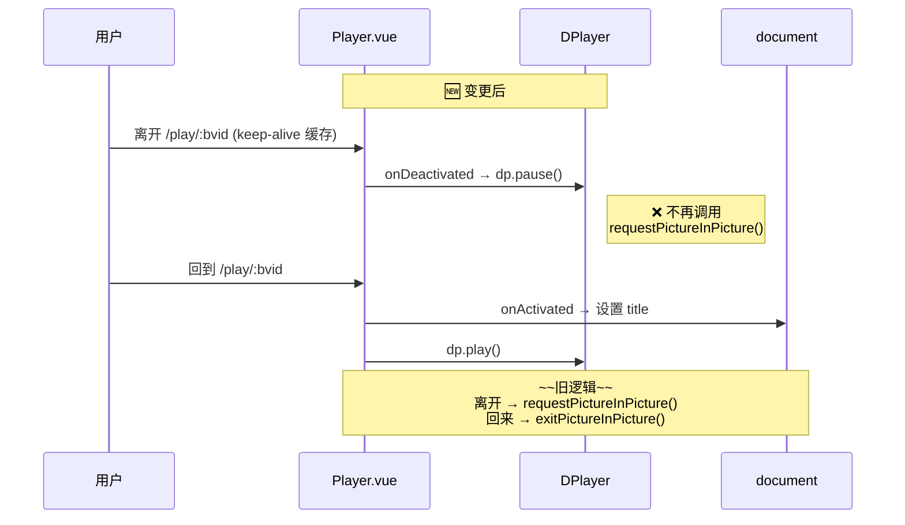

# 代码变更审查报告

## 1. 高层摘要 (TL;DR)

*   **影响等级：** 🟡 **中**
*   **核心变化：** 移除浏览器原生画中画 (PiP) 功能（涉及前端播放页、README、App.vue），修复 `get_playurl` 因 WBI 签名参数变化导致缓存命中率低的问题，扩展前端搜索结果缓存并增加页码导航。
*   **关键变更：**
    *   🗑️ **移除 PiP 画中画**：从 Player.vue、App.vue、README 全部下线该功能。
    *   ⚡ **修复 playurl 缓存失效**：后端改用稳定业务参数 `(bvid, cid, qn)` 作为缓存 key。
    *   🗂️ **前端搜索结果 5 分钟缓存**：Home.vue 引入模块级 LRU 缓存（最多 50 条）。
    *   📄 **页码器升级**：从「上一页/页码/下一页」改为带省略号的完整页码导航。
    *   🔒 **播放器锁 16:9 比例**：避免视频源尺寸变化造成布局跳动。

---

## 2. 可视化总览（代码与逻辑地图）

### 2.1 playurl 缓存流程变更


### 2.2 Home.vue 搜索 + 缓存 + 分页整体交互


### 2.3 Player.vue 离/回页面行为变更


---

## 3. 详细变更分析

### 3.1 🗑️ 移除画中画 (PiP) 功能

| 涉及文件 | 删除内容 |
|---|---|
| `frontend/src/views/Player.vue` | 删除 `leavepictureinpicture` 事件监听；`onDeactivated` 中不再调用 `requestPictureInPicture()`；`onActivated` 中不再调用 `exitPictureInPicture()` |
| `README.md` | 删去特性列表中「📺 画中画」行；删除 Player.vue 描述中的「/画中画」；删除两条 PiP 相关 Q&A |

*   **新行为**：离开播放页仅 `dp.pause()`，回到页面再 `dp.play()`。
*   **理由推断**：注释提到「避免原生 PiP 的尺寸/关闭问题」，即原生 PiP 窗口按钮无法区分、标题无法自定义等硬限制带来的体验问题。

### 3.2 ⚡ 后端 `get_playurl` 缓存重构（Source: `backend/utils/bili_api.py`）

| 维度 | 旧实现 | 新实现 |
|---|---|---|
| 缓存入口 | `_cached_request()` 内部按完整 URL+params 哈希 | 手动管理 `_cache[cache_key]` |
| 缓存 key | 包含 `wts`/`w_rid` 签名参数（每次都变） | `f"playurl:{bvid}:{cid}:{qn}"` 稳定业务键 |
| 命中率 | ❌ 几乎为 0 | ✅ 1 小时内同 (bvid,cid,qn) 直接命中 |
| 请求方法 | `_cached_request(..., ttl=3600)` | `_request(..., timeout=15)` |

> 📌 **关键代码（新增）**：
> ```python
> cache_key = f"playurl:{bvid}:{cid}:{qn}"
> now = time.time()
> if cache_key in _cache:
>     ts, data = _cache[cache_key]
>     if now - ts < 3600:
>         return data
> ```

*   **影响**：同一视频在 1 小时内多次访问不再触发 WBI 签名和 B站 API 调用，显著降低接口压力。

### 3.3 🗂️ 搜索缓存 TTL 调整

| 配置项 | 文件 | 旧值 | 新值 | 说明 |
|---|---|---|---|---|
| 默认 `bili_search_cache_ttl` | `backend/config.py` | `60` 秒 | `300` 秒（5 分钟） | 搜索结果页内反复切页可命中 |
| `update_rate_config` 上限 | `backend/main.py` | `300` 秒 | `1800` 秒（30 分钟） | 放宽前端可调范围 |

### 3.4 🖥️ 前端 Home.vue 大改造（Source: `frontend/src/views/Home.vue`）

#### 3.4.1 模块级搜索结果缓存

| 参数 | 值 |
|---|---|
| 缓存位置 | `<script>`（非 `<script setup>`）模块作用域 |
| Key | `${query}_${page}` |
| TTL | 5 分钟（`_SEARCH_CACHE_TTL = 5 * 60 * 1000`） |
| 上限 | 50 条（LRU 淘汰最早写入） |
| 持久性 | 组件销毁后仍保留，刷新页面才会丢失 |

```js
function _getCachedSearch(q, p) { /* TTL 校验 + 过期清理 */ }
function _setCachedSearch(q, p, videos, total) { /* 超 50 则删首个 key */ }
```

#### 3.4.2 `route.query.q` 监听器优化（关键逻辑修正）

*   **旧问题**：从 Player.vue 返回时（keep-alive 生效），`q` 被设为空时会把搜索结果清空，导致用户回来时丢失页码和结果。
*   **新逻辑**：
    *   `q` 与 `query.value` 一致且已有结果 → 直接 return，复用 keep-alive 状态。
    *   `q` 为空但 `route.path !== '/'` → 视为导航副作用，直接 return 保留状态。
    *   仅在 `q` 为空 **且** 仍在首页时才清空。

#### 3.4.3 完整页码导航

| 场景 | 展示 |
|---|---|
| `totalPages <= 7` | 1 2 3 4 5 6 7 |
| `totalPages > 7`（首页） | 1 2 3 4 5 ... N |
| 中间页 | 1 ... 4 5 **6** 7 8 ... N |
| 末页 | 1 ... N-4 N-3 N-2 N-1 N |

CSS 新增 `.page-num.active`（橙色高亮）和 `.page-num.ellipsis`（禁用悬停态）。

### 3.5 🔧 前端 `api.js` 缓存 key 升级

| 项 | 旧 | 新 |
|---|---|---|
| Cache key | `${bvid}_${cid}` | `${bvid}_${cid}_${qn}` |
| `clearPlayurlCache` 签名 | `(bvid, cid)` | `(bvid, cid, qn=80)` |

*   **原因**：不同清晰度下 CDN URL 不同，必须区分；与后端 `cache_key` 策略保持一致。

### 3.6 🧱 App.vue 与 Player.vue 样式调整

*   **App.vue**：`<keep-alive :include="['Player', 'Home']">` —— 把 Home 加入缓存，使从 Player 返回时不重置搜索结果。
*   **Player.vue**：
    *   移除 `.player-empty` 兜底样式。
    *   `.player-wrap` 强制 `aspect-ratio: 16/9` 锁比例。
    *   内部 `:deep(.dplayer-video)` 设置 `object-fit: contain`，让非 16:9 视频源居中留黑边而非拉伸。

### 3.7 📁 `.gitignore` 新增

```diff
+ scripts/
```

---

## 4. 影响与风险评估 ⚠️

### 4.1 破坏性变更

*   ❌ **PiP 功能完全下线**：用户从播放页切走后视频不再以画中画形式继续播放，改为暂停。这对依赖「边看边搜」体验的用户是行为变化。
*   ⚠️ **`api.clearPlayurlCache` 签名变更**：若项目其他位置（含测试代码）调用此函数，参数数量变化需同步更新（默认参数 `qn=80` 已做兼容）。

### 4.2 兼容性 / 行为差异

*   **后端缓存语义**：`get_playurl` 不再走 `_cached_request`，其内部的全局 TTL/限频/重试封装被旁路。仍由 `_sign_wbi` → `_request`（带 15s 超时）链路保证请求本身稳定，但**自定义 401/-999 等业务异常的处理路径需要人工核对**是否仍生效。
*   **前端 LRU 缓存**：`Map` 迭代器是按插入顺序，LRU 实现是「删最早插入」，并非真正的「最近最少使用」——若用户高频翻页，最早的旧 key 会被淘汰，但热点 key 不会被自动刷新顺序。**对当前用例影响很小**。

### 4.3 测试建议 ✅

1. **缓存命中**：连续请求同一 `bvid/cid/qn` 两次，验证第二次直接返回，**日志/网络层无 B站 API 请求**。
2. **不同清晰度**：`qn=80` 与 `qn=112` 应各自独立缓存。
3. **搜索缓存**：在 Home 页搜索 → 跳到 Player → 返回 Home（**注意 App.vue 路由需配 keep-alive 生效**），验证结果与页码保留；5 分钟后再次搜索应重新发请求。
4. **页码器**：
    *   少于等于 7 页：显示全部。
    *   多于 7 页且在首页：尾页为「... N」格式。
    *   中间页省略号点击应被禁用。
5. **从 Player 返回行为**：离开播放页应立即暂停；返回后应自动继续播放（视频源已就绪时）。
6. **播放器 16:9**：分别加载 16:9、9:16、4:3 视频源，验证布局稳定（无拉伸、无尺寸跳动）。
7. **README 截图/链接**：若文档站有外链引用被删的「画中画」段落，需一并更新。

### 4.4 审查要点 🔍

*   `backend/utils/bili_api.py`：手动管理 `_cache` 时，**未做并发锁**。FastAPI 异步环境下，同一 key 并发首次请求可能写入两次（结果相同，影响极小，但建议确认 `_cache` 本身是否为线程/协程安全的数据结构）。
*   `frontend/src/views/Home.vue`：`_searchCache` 是**全用户共享**（无 userId 维度），多账号切换场景下需配合 `clearAllPlayurlCache` 之类的机制——当前 diff 未体现用户维度的失效逻辑，**建议确认 `changeUser` 流程是否也会清搜索缓存**。